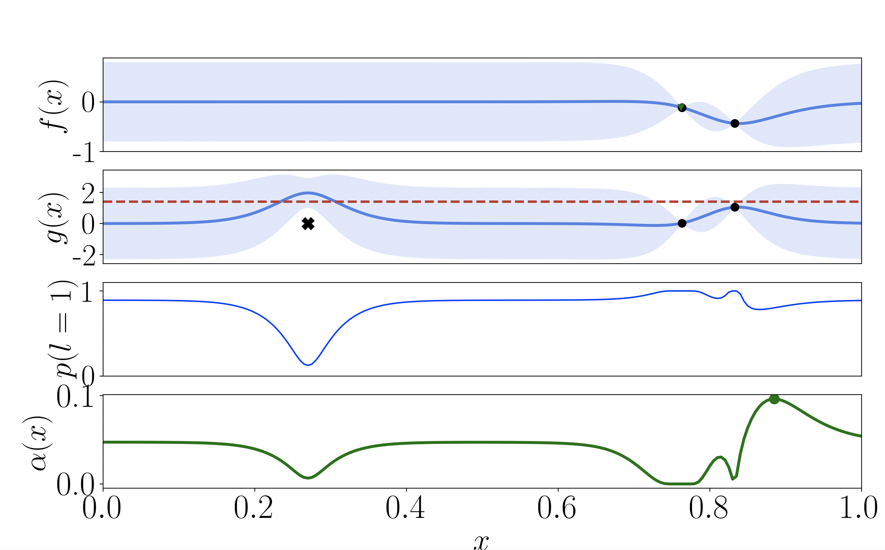

Description
=========
This python package, `classified_regression`, deploys the EIC2 framework described in the following paper:

> Robot Learning with Crash Constraints
> Alonso Marco, Dominik Baumann, Majid Khadiv, Philipp Hennig, Ludovic Righetti and Sebastian Trimpe
> https://arxiv.org/abs/2010.08669
> Status: Under review

The user can run a 1D example where the algorithm finds the optimum on a constrained minimization problem with a single constraint. The objective f to be minimized is modeled with a standard GP. The constraint g is modeled with GPCR, i.e., the novel GP model proposed in this paper. Such model handles a hybrid set of observations: discrete labels (failure/success) and continuous values (obtained only upon success) and also estimates the constraint threshold from data.


Requirements
============

The algorithm runs in Python >= 3.7, and is developed under [BoTorch](https://botorch.org/). [BoTorch](https://botorch.org/) is a flexible framework for developing new Bayesian optimization algorithms. It builds on [Pytorch](https://pytorch.org/) and uses [scipy Python optimizers](https://docs.scipy.org/doc/scipy/reference/tutorial/optimize.html) for GP model fitting and acquisition function optimization. 

> If your python installation does not meet the minimum requirement, we recommend creating a virtual environment with the required python version. For example, [Anaconda](https://www.anaconda.com/distribution/) allows this, and does not interfere with your system-wide Python installation underneath. 

> NOTE: We recommend opening this README.md file in an online Markdown editor/viewer, e.g., [StackEdit](https://stackedit.io/app#), for better readability.

Installation 
============

1. Make sure your python version meets the required one. For this, open a terminal and type
```bash
python --version
```
2. Install the following dependencies
```bash
pip install numpy botorch==0.3.0 matplotlib pyyaml hydra-core==0.11.3 nlopt==2.6.2
```
3. Clone this repository to your desired path:
```bash
git clone https://github.com/alonrot/classified_regression.git
```
4. Navigate to the package folder and install it
```bash
cd <path/to/classified_regression>
pip install -e .
```

Running a 1D example
====================

```bash
cd <path/to/classified_regression>/classireg/experiments/numerical_benchmarks
python run_experiments.py
```

The algorithm is initialized with two points, randomly sampled within the domain.

Several verbose messages should be shown in the terminal, as the algorithm progresses. In addition, a plot similar to Fig. 2 in the paper should pop up (see the figure below), depicting the objective f, the constraint, the probability of constraint satisfaction (omitted in the paper due to space constraints, but computable via eq. (9) in the paper), and the acquisition function (expected improvement with constraints).



Running global optimization benchmarks
======================================

The file
```bash
<path/to/classified_regression>/classireg/experiments/numerical_benchmarks/config.yaml
```
is a configuration file based on [Hydra](https://hydra.cc/), where the user can select the benchmark to be used. To run experiments using `Michalewicz 10D` as objective function, comment the line `- config: simple1D` and uncomment the line `- config: micha10D`. By default, the used acquisition function is `acqui: EIC`, which is our proposed algorithm EIC^2, where the constraint is modeled using the GPCR model. Once the above changes have been applied to the config file, run the code as:

```bash
cd <path/to/classified_regression>/classireg/experiments/numerical_benchmarks
python run_experiments.py
```

A new folder will be created, containing the saved results at
```bash
<path/to/classified_regression>/classireg/experiments/numerical_benchmarks/micha10D/EIC_results/<folder_name>/data_0.yaml
```

The hyperprior distribution for the hyperparameters, and other parameter choices can be found in
```bash
<path/to/classified_regression>/classireg/experiments/numerical_benchmarks/config/micha10D.yaml
```
under the `gpcr_model` structure. The `beta` and `gamma` distributions are parametrized according to the Python library `scipy.stats`. See a detailed description of the implementation of the [beta](https://docs.scipy.org/doc/scipy/reference/generated/scipy.stats.beta.html) and [gamma](https://docs.scipy.org/doc/scipy/reference/generated/scipy.stats.gamma.html) distributions.

Running SafeOpt and PIBU
========================
In the paper, we compare against these two popular BOC methods. We have included such comparisons in the code. They can be found in
```bash
<path/to/classified_regression>/classireg/experiments/numerical_benchmarks/pibu/
```
and
```bash
<path/to/classified_regression>/classireg/experiments/numerical_benchmarks/run_safeopt.py
```

General comments
================

 * All the hyperparameters are tunable and can be found in `<path/to/classified_regression>/classireg/experiments/numerical_benchmarks/config/simple1D.yaml`, and modified.
 * The first time any of the above algorithms are run, they can take a few seconds to start.
 * The GPCR model is implemented in
```bash
<path/to/classified_regression>/classireg/models/gpcr_model.py
```

Known issues for macOS users
============================
 * If any of the aforementioned plots do not automatically pop up, try uncommenting line 3 in the file `<path/to/classified_regression>/classireg/utils/plotting_collection.py`
```python
matplotlib.use('TkAgg') # Solves a no-plotting issue for macOS users
```

 * Support for using GPU is at the moment not fully implemented.
 
 * If you encounter problems while installing PyTorch, check [here](https://pytorch.org/get-started/locally/).


